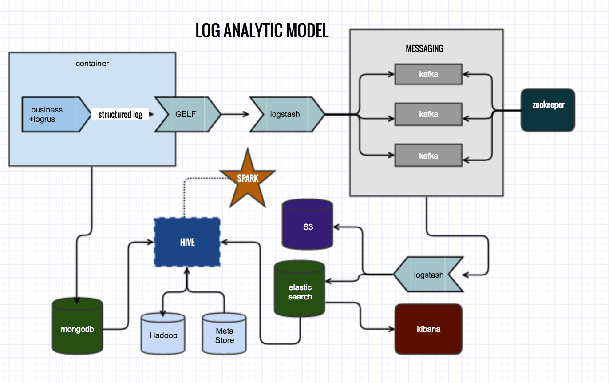

# Practical Log Analysis

## scenario

tested on the versions below:
* apache-hive-2.1.0-bin.tar.gz
* elasticsearch-5.0.1.tar.gz
* kafka_2.11-0.10.1.0.tgz
* kibana-5.0.1-linux-x86_64.tar.gz
* logstash-5.0.0.tar.gz
* mysql-connector-java-5.1.40.tar.gz
* spark-1.6.3-bin-hadoop2-without-hive.tgz
* hadoop-2.6.5.tar.gz

## hadoop
* http://hadoop.apache.org/docs/stable/hadoop-project-dist/hadoop-common/SingleCluster.html  -- 单节点hdfs部署
* https://github.com/chrislusf/gleam -- Fast, efficient, and scalable distributed map/reduce system written in Go and LuaJIT

## kafka
* https://kafka.apache.org/documentation   --kafka官方文档
* https://www.elastic.co/blog/just-enough-kafka-for-the-elastic-stack-part1  -- es和kafka的最佳实践
* https://www.elastic.co/blog/just-enough-kafka-for-the-elastic-stack-part2
* https://github.com/travisjeffery/jocko   --golang的kafka复刻
* https://github.com/oldratlee/translations/blob/master/log-what-every-software-engineer-should-know-about-real-time-datas-unifying/README.md --经典

## logstash
* https://www.elastic.co/guide/en/logstash/current/index.html -- Centralize, Transform & Stash Your Data
* https://github.com/influxdata/telegraf -- The plugin-driven server agent for collecting & reporting metrics.
* https://www.elastic.co/guide/en/logstash/current/deploying-and-scaling.html -- logstash部署

## hive
* https://cwiki.apache.org/confluence/display/Hive/GettingStarted -- hive配置
* https://cwiki.apache.org/confluence/display/Hive/LanguageManual --hive的SQL手册
* https://github.com/xtaci/json2hive -- 通过json构造hive schema

## metastore
* https://hub.docker.com/_/mysql/  -- 可以给metastore用的mysql镜像
* https://issues.apache.org/jira/secure/attachment/12471108/HiveMetaStore.pdf   -- metastore结构
* https://cwiki.apache.org/confluence/display/Hive/AdminManual+MetastoreAdmin -- metastore配置
* https://cwiki.apache.org/confluence/display/Hive/Hive+Schema+Tool -- schema创建

## spark
* https://cwiki.apache.org/confluence/display/Hive/Hive+on+Spark%3A+Getting+Started -- hive和spark集成
* http://spark.apache.org/docs/latest/spark-standalone.html -- spark配置
* http://mangocool.com/1467770109867.html -- hive on spark的版本问题
* http://www.csdn.net/article/2015-04-24/2824545 -- Intel李锐：Hive on Spark解析

## elasticsearch
* https://www.elastic.co/guide/en/elasticsearch/hadoop/current/hive.html --es和hive的集成
* https://www.elastic.co/blog/found-sizing-elasticsearch -- es索引规划，容量规划
* https://www.elastic.co/blog/performance-indexing-2-0 -- es索引
* https://www.elastic.co/blog/found-elasticsearch-from-the-bottom-up --es内部原理
* https://www.elastic.co/guide/en/elasticsearch/reference/current/indices-templates.html -- index模板
* https://www.elastic.co/blog/found-elasticsearch-in-production --es生产部署
* https://www.smashingmagazine.com/2012/05/stop-redesigning-start-tuning-your-site/
* https://www.elastic.co/blog/customizing-your-document-routing -- es读取优化
* https://www.elastic.co/videos/big-data-search-and-analytics
* https://www.elastic.co/blog/disk-based-field-data-a-k-a-doc-values
* https://aphyr.com/posts/288-the-network-is-reliable
* https://aphyr.com/posts/281-call-me-maybe-carly-rae-jepsen-and-the-perils-of-network-partitions
* https://www.elastic.co/guide/en/elasticsearch/reference/current/docs-reindex.html --mapping重建
* http://www.cnblogs.com/Creator/p/3722408.html --mapping重建
* http://wzktravel.github.io/2016/05/11/elasticsearch-reindex/  --mapping重建

## s3
* https://www.elastic.co/guide/en/elasticsearch/reference/current/modules-snapshots.html  --es数据备份
* https://www.elastic.co/guide/en/elasticsearch/plugins/5.0/repository-s3.html --es备份到s3的插件
* https://github.com/minio/minio --s3兼容存储

## mongodb:
* https://github.com/mongodb/mongo-hadoop 
* https://github.com/mongodb/mongo-hadoop/wiki/Hive-Usage -- hive和mongodb的集成
* https://docs.mongodb.com/manual/tutorial/deploy-replica-set/ -- mongodb复制集部署
* https://www.mongodb.com/blog/post/using-mongodb-hadoop-spark-part-1-introduction-setup -- mongodb和spark/hive集成
* https://www.mongodb.com/blog/post/using-mongodb-hadoop-spark-part-2-hive-example
* https://www.mongodb.com/blog/post/using-mongodb-hadoop-spark-part-3-spark-example-key-takeaways

## application library
* https://github.com/gliderlabs/logspout -- 采集docker容器的标准输出
* https://github.com/Sirupsen/logrus -- 结构化日志输出
